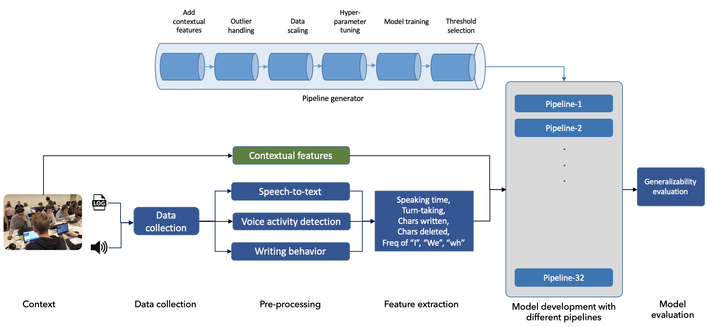

# 

#### Impact of window size on the generalizability of collaboration qualityestimation models developed using Multimodal Learning Analytics

This repository contains source code for data analysis for LAK 2023 reserach paper where audio and log data were used to model collaboration quality (and its dimensions). The paper investigated various model building pipelines for classifying collaboration quality using multimodal data.

##### Abstract

Multimodal learning analytics (MMLA) research for building collaboration quality estimation models has shown significant progress. However, the generalizability of such models is seldom addressed. In this paper, we address this gap by systematically evaluating the across-context generalizability of collaboration quality models developed using a typical MMLA pipeline. This paper further presents a methodology to explores modelling pipelines with different configurations to improve the generalizability of the model. We
collected 11 multimodal datasets (audio and log data) from face-to-face collaborative learning activities in six different classrooms with five different subject teachers. Our results showed that the models developed using the often-employed MMLA pipeline degraded in terms of Kappa from Fair (.20 < Kappa < .40) to Poor (Kappa < .20) when evaluated across contexts. This degradation in performance was significantly improved with pipelines that emerged as high-performing from our exploration of 32 pipelines. Furthermore, our exploration of pipelines provided statistical evidence that often-overlooked contextual data features improve the generalizability of a collaboration quality model. With these findings, we make recommendations for the modelling pipeline which can potentially help other researchers in achieving better generalizability in their collaboration quality estimation models.

##### Methodology

#### License

Permission is hereby granted, free of charge, to any person obtaining a copy of this software and associated documentation files (the  "Software"), to deal in the Software without restriction, including  without limitation the rights to use, copy, modify, merge, publish,  distribute, sublicense, and/or sell copies of the Software, and to  permit persons to whom the Software is furnished to do so, subject to  the following conditions:

The above copyright notice and this permission notice shall be included in all copies or substantial portions of the Software.

THE SOFTWARE IS PROVIDED "AS IS", WITHOUT WARRANTY OF ANY KIND,  EXPRESS OR IMPLIED, INCLUDING BUT NOT LIMITED TO THE WARRANTIES OF  MERCHANTABILITY, FITNESS FOR A PARTICULAR PURPOSE AND NONINFRINGEMENT.  IN NO EVENT SHALL THE AUTHORS OR COPYRIGHT HOLDERS BE LIABLE FOR ANY  CLAIM, DAMAGES OR OTHER LIABILITY, WHETHER IN AN ACTION OF CONTRACT,  TORT OR OTHERWISE, ARISING FROM, OUT OF OR IN CONNECTION WITH THE  SOFTWARE OR THE USE OR OTHER DEALINGS IN THE SOFTWARE.